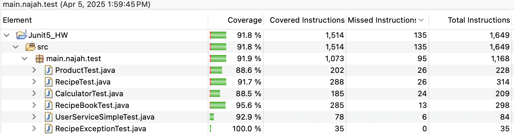

# JUnit5-HW - Software Testing and Quality Assurance

**Second Semester 2024/2025**  
**Homework Assignment #2**  
**Deadline: 05 April 2025**  

## 📚 Overview

### 1. Test Features
Each test class includes:
- ✅ Valid and invalid input cases
- ✅ Descriptive test names using `@DisplayName`
- ✅ At least one parameterized test using `@ParameterizedTest`
- ✅ Timeout tests using `@Timeout`
- ✅ Multiple assertions using `assertAll`

### 2. Test Suite
- ✅ A test suite `AllTestsSuite.java` is created using `@Suite` to run all tests together.

### 3. Ordered Test Execution
- ✅ `CalculatorTest.java` uses `@TestMethodOrder(OrderAnnotation.class)` and `@Order` to demonstrate ordered execution.

### 4. Lifecycle Hooks
- ✅ `RecipeBookTest.java` uses:
  - `@BeforeAll` and `@AfterAll`
  - `@BeforeEach` and `@AfterEach`
  - Debug messages such as `"setup complete"` and `"teardown complete"` are printed.

### 5. Disabled Failing Test
- ✅ One test is intentionally failing and disabled using `@Disabled`, with a comment explaining how to fix it.

### 6. Code Coverage
- ✅ Measured using **EclEmma**
- ✅ Achieved **~91.8% total coverage**, with each individual test class achieving above **85%**
#### 📸 Code Coverage Report:

### 7. Parallel Execution
- ✅ `UserServiceSimpleTest.java` is executed in parallel using `@Execution(ExecutionMode.CONCURRENT)`

